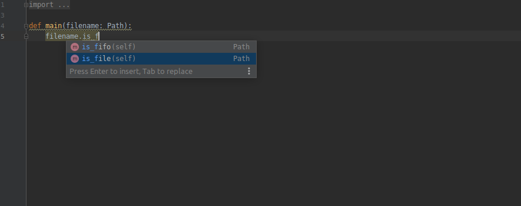

## Design based on **FastAPI**

**Typer** is <a href="https://fastapi.tiangolo.com" target="_blank">FastAPI</a>'s little sibling.

It follows the same design and ideas. If you know FastAPI, you already know **Typer**... more or less.

## Just Modern Python

It's all based on standard **Python 3.6 type** declarations. No new syntax to learn. Just standard modern Python.

If you need a 2 minute refresher of how to use Python types (even if you don't use FastAPI or Typer), check the FastAPI tutorial section: <a href="https://fastapi.tiangolo.com/python-types/" target="_blank">Python types intro</a>.

You will also see a 20 seconds refresher on the section [Tutorial - User Guide: First Steps](tutorial/first-steps.md).

## Editor support

**Typer** was designed to be easy and intuitive to use, to ensure the best development experience. With autocompletion everywhere.

You will rarely need to come back to the docs.

Here's how your editor might help you:

* in <a href="https://code.visualstudio.com/" class="external-link" target="_blank">Visual Studio Code</a>:

* in <a href="https://www.jetbrains.com/pycharm/" class="external-link" target="_blank">PyCharm</a>:

You will get completion for everything. That's something no other CLI library provides right now.

No more guessing what type was that variable, if it could be `None`, etc.

### Short

It has sensible **defaults** for everything, with optional configurations everywhere. All the parameters can be fine-tuned to do what you need, customize the help, callbacks per parameter, make them required or not, etc.

But by default, it all **"just works"**.

## User friendly CLI apps

The resulting CLI apps created with **Typer** have the nice features of many "pro" command line programs you probably already love.

* Automatic help options for the main CLI program and all the its subcommands.
* Automatic command and subcommand structure handling (you will see more about subcommands in the Tutorial - User Guide).
* Automatic autocompletion for the CLI app in all operating systems, in all the shells (Bash, Zsh, Fish, PowerShell), so that the final user of your app can just hit <kbd>TAB</kbd> and get the available options or subcommands. *

!!! note "* Autocompletion"
    For the autocompletion to work on all shells you also need to add the dependency `click-completion`.

    Just that. And **Typer** does the rest.
    
    If **Typer** detects `click-completion` installed, it will automatically create 2 *CLI options*:

    * `--install-completion`: Install completion for the current shell.
    * `--show-completion`: Show completion for the current shell, to copy it or customize the installation.    

    Then you can tell the user to run that command and the rest will just work.

## The power of Click

<a href="https://click.palletsprojects.com" class="external-link" target="_blank">Click</a> is one of the most popular tools for building CLIs in Python.

**Typer** is based on it, so you get all its benefits, plug-ins, robustness, etc.

But you can write simpler code with the benefits of modern Python.

<!-- 

TODO

### Tested

* 100% <abbr title="The amount of code that is automatically tested">test coverage</abbr>.
* 100% <abbr title="Python type annotations, with this your editor and external tools can give you better support">type annotated</abbr> code base.
* Used in production applications. -->
